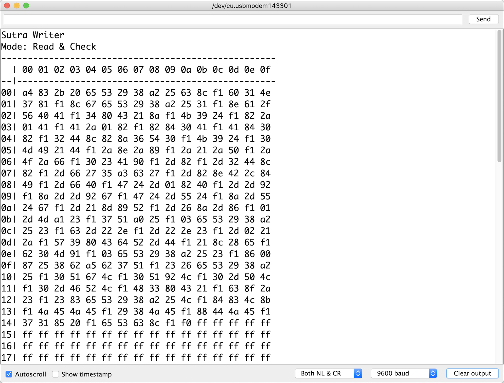

# SutraWriter

EEPROM writer for [mokugyOS](https://github.com/ukkz/mokugyOS).  
For detail, see <https://github.com/ukkz/mokugyOS>.

## Usage

1. Upload this sketch to your ATmega32u4 based arduino.
2. Open Serial monitor window to check the device's EEPROM status.

3. Once finished, try to upload [mokugyOS](https://github.com/ukkz/mokugyOS) and enjoy chanting.

## Sutra Format

see below (Japanese):  
[組み込みで般若心経を扱う際の効率的なメモリ配置方法の検討](https://zenn.dev/ukkz/articles/02c243a6ba7795)

## License

This project is licensed under the MIT License - see the LICENSE.md file for details.